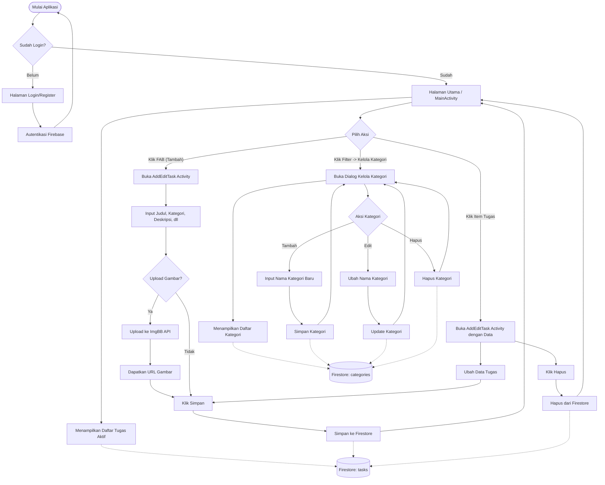

# Flowchart CRUD Daily Task Manager

Berikut adalah visualisasi alur (Flowchart) untuk operasi CRUD (Create, Read, Update, Delete) pada aplikasi Daily Task Manager Anda, yang mencakup entitas **Tugas (Task)** dan **Kategori (Category)**.

### Penjelasan Flowchart:
1. **Autentikasi (Start)**: Semua alur CRUD membutuhkan user (pengguna) untuk login terlebih dahulu melalui Firebase Auth. Setiap data yang disimpan terkait dengan `userId` dari pengguna yang sedang aktif.
2. **Read (Membaca Data)**: 
   - Di `MainActivity`, aplikasi melakukan *listen* (Realtime Updates) ke Firestore koleksi `tasks` untuk mengambil data tugas yang belum selesai.
   - Di Dialog Kelola Kategori, aplikasi melakukan *listen* ke Firestore koleksi `categories`.
3. **Alur Tugas (Tasks)**:
   - **Create**: Mengklik tombol Floating Action Button (FAB) akan membuka form kosong. Gambar bisa diupload ke *ImgBB API*, kemudian seluruh data disimpan ke `tasks` di Firestore.
   - **Update**: Mengklik item tugas yang ada di daftar akan membuka form dengan data yang sudah terisi. User bisa mengubah nilainya dan menyimpannya (Overwrite dokumen di Firestore).
   - **Delete**: Di halaman form tugas (Edit), terdapat tombol untuk menghapus dokumen tugas dari Firestore.
4. **Alur Kategori (Categories)**:
   - **Create**: Di dalam dialog kelola kategori, mengeklik tombol "Tambah" akan memunculkan form input untuk menambah kategori baru.
   - **Update**: Menekan tombol edit pada list kategori akan memungkinkan pengguna memperbarui nama kategori tersebut di Firestore.
   - **Delete**: Menekan icon hapus pada list kategori akan menghapus dokumen kategori tersebut dari Firestore.
